# Chương 3. Phân tích yêu cầu hệ thống

Chương này trình bày các yêu cầu chức năng/phi chức năng, các tác nhân (actors) và các use case chính của hệ thống giám sát – cảnh báo sức khỏe. Các yêu cầu được tổng hợp dựa trên phạm vi đồ án và cách triển khai hiện tại của dự án (ESP32 gửi telemetry lên ThingsBoard, backend xử lý nghiệp vụ và nhận alarm từ ThingsBoard, web hiển thị và nhận thông báo realtime).

## 3.1 Mô hình hóa nghiệp vụ (tổng quan)

### 3.1.1 Các dịch vụ chính của hệ thống

Ở mức nghiệp vụ, hệ thống có thể được nhìn như các nhóm dịch vụ chính:

- **Xác thực & phân quyền**: đăng nhập/refresh/logout/đổi mật khẩu.
- **Quản trị**: quản lý bác sĩ, xem danh sách thiết bị.
- **Nghiệp vụ bác sĩ**: CRUD bệnh nhân, allocate/recall thiết bị, xem health info.
- **Nghiệp vụ bệnh nhân/người nhà**: xem thông tin và chỉ số sức khỏe của chính mình.
- **Cảnh báo**: nhận alarm từ ThingsBoard, đẩy realtime + gửi email.
- **Tệp/ảnh đại diện**: upload, truy vấn URL, tải avatar.

### 3.1.2 Các quy trình nghiệp vụ chính của hệ thống

#### a) **Giám sát & truy vấn**:

1. Web gọi backend để xem danh sách bệnh nhân và health info
2. Backend truy vấn telemetry từ ThingsBoard.
3. Web hiển thị kết quả cho người dùng

#### b). **Cảnh báo**:

1. ThingsBoard phát hiện bất thường
2. Tạo alarm
3. Gọi webhook về backend →
4. Backend thông báo realtime/email tới bác sĩ.

#### c) Quy trình bật thiết bị và kết nối ThingsBoard

Quy trình này mô tả luồng từ lúc **bác sĩ/nhân viên vận hành bật thiết bị (cấp nguồn)** đến khi thiết bị **kết nối ThingsBoard** và **bắt đầu gửi dữ liệu** ở mức nghiệp vụ/vận hành. (Phần mô tả kỹ thuật chi tiết theo module firmware sẽ được trình bày ở **Chương 5**.)

1. **Bật thiết bị**: thiết bị khởi động, tự kiểm tra trạng thái và đọc cấu hình đã lưu.
2. **Xác định trạng thái cấu hình**:

- Nếu **chưa có thông tin Wi‑Fi** hoặc cần cấu hình lại -> chuyển sang **chế độ cấu hình (AP)** để người vận hành nhập thông tin.
- Nếu **đã có Wi‑Fi** -> chuyển sang **chế độ kết nối (Station)**.

3. **Cấu hình Wi‑Fi và định danh nghiệp vụ (nếu cần)**:

- Người vận hành kết nối vào mạng cấu hình của thiết bị và nhập Wi‑Fi.
- Trong trường hợp gắn thiết bị cho bệnh nhân cụ thể, có thể nhập thêm thông tin định danh (bệnh nhân/bác sĩ) để hệ thống liên kết dữ liệu đúng đối tượng.

4. **Kết nối Wi‑Fi**: thiết bị kết nối vào mạng Wi‑Fi đã cấu hình. Nếu thất bại/timeout -> quay lại chế độ cấu hình để nhập lại.
5. **Đăng ký/xác thực thiết bị với ThingsBoard (Provisioning)**: khi có đủ thông tin định danh cần thiết, thiết bị thực hiện bước đăng ký để lấy thông tin xác thực nhằm kết nối lên ThingsBoard.
6. **Kết nối ThingsBoard và gửi dữ liệu**: thiết bị kết nối lên ThingsBoard và bắt đầu:

- Gửi **attributes** (định danh nghiệp vụ) để hệ thống tra cứu/định tuyến dữ liệu.
- Gửi **telemetry** định kỳ (nhịp tim, SpO₂, nhiệt độ, trạng thái cảnh báo…).

7. **Duy trì kết nối & khôi phục khi lỗi**: khi mất Wi‑Fi hoặc mất kết nối ThingsBoard, thiết bị tự retry/khôi phục; nếu không khôi phục được trong thời gian hợp lý thì quay lại chế độ cấu hình để can thiệp.
8. **Cập nhật firmware (nếu có)**: hệ thống có thể phát hiện bản cập nhật và thiết bị thực hiện cập nhật theo chính sách triển khai.

#### d). **Thu hồi thiết bị**:

....

## 3.2 Yêu cầu chức năng & phi chức năng

### 3.2.1 Yêu cầu chức năng (Functional Requirements)

Các yêu cầu chức năng được nhóm theo thành phần hệ thống.

#### Nhóm yêu cầu cho hệ Web/Backend

| Mã    | Yêu cầu chức năng                 | Tác nhân             | Mô tả tóm tắt                                                                                                                     |
| ----- | --------------------------------- | -------------------- | --------------------------------------------------------------------------------------------------------------------------------- |
| FR-01 | Đăng nhập                         | Admin/Doctor/Patient | Người dùng đăng nhập và nhận access token (và refresh token nếu có) để sử dụng hệ thống.                                          |
| FR-02 | Làm mới phiên (refresh token)     | Admin/Doctor/Patient | Cho phép lấy access token mới khi hết hạn.                                                                                        |
| FR-03 | Đăng xuất                         | Admin/Doctor/Patient | Thu hồi/khóa phiên sử dụng theo cơ chế hệ thống.                                                                                  |
| FR-04 | Đổi mật khẩu                      | Admin/Doctor         | Người dùng đổi mật khẩu theo chính sách tối thiểu.                                                                                |
| FR-05 | Quản lý bác sĩ (CRUD)             | Admin                | Admin tạo/xem/sửa/xóa hồ sơ bác sĩ.                                                                                               |
| FR-06 | Xem danh sách thiết bị            | Admin                | Admin xem danh sách thiết bị (liên quan ThingsBoard/DB).                                                                          |
| FR-07 | Xem & cập nhật hồ sơ bác sĩ       | Doctor               | Bác sĩ xem/cập nhật thông tin cá nhân (profile).                                                                                  |
| FR-08 | Quản lý bệnh nhân (CRUD)          | Doctor               | Bác sĩ tạo/xem/sửa/xóa hồ sơ bệnh nhân.                                                                                           |
| FR-09 | Xem danh sách bệnh nhân           | Doctor               | Bác sĩ xem danh sách bệnh nhân, hỗ trợ phân trang và tìm kiếm.                                                                    |
| FR-10 | Xem chi tiết bệnh nhân            | Doctor               | Xem chi tiết thông tin bệnh nhân theo ID.                                                                                         |
| FR-11 | Xem chỉ số sức khỏe bệnh nhân     | Doctor               | Backend lấy telemetry mới nhất từ ThingsBoard theo deviceId đã liên kết.                                                          |
| FR-12 | Cấp phát thiết bị cho bệnh nhân   | Doctor               | Tìm device trên ThingsBoard theo attributes (patient CCCD), liên kết vào hồ sơ bệnh nhân và tạo bản ghi device trong MongoDB.     |
| FR-13 | Thu hồi thiết bị                  | Doctor               | Hủy liên kết device khỏi bệnh nhân và xóa bản ghi device trong MongoDB; có thể xóa device trên ThingsBoard (tùy điều kiện token). |
| FR-14 | Bệnh nhân xem thông tin cá nhân   | Patient              | Bệnh nhân truy vấn hồ sơ của chính mình.                                                                                          |
| FR-15 | Bệnh nhân xem tình trạng sức khỏe | Patient              | Bệnh nhân xem telemetry mới nhất của chính mình (thông qua backend).                                                              |
| FR-16 | Nhận alarm từ ThingsBoard         | ThingsBoard/Backend  | Backend cung cấp endpoint để ThingsBoard gọi khi phát sinh alarm.                                                                 |
| FR-17 | Thông báo realtime alarm          | Backend/Web          | Backend phát Socket.IO tới doctor client; web hiển thị cảnh báo.                                                                  |
| FR-18 | Gửi email alarm                   | Backend              | Backend gửi email tới bác sĩ khi có alarm.                                                                                        |
| FR-19 | Upload avatar                     | Admin/Doctor/Patient | Upload ảnh đại diện (multer + xử lý ảnh), lưu lên S3 và cập nhật URL vào MongoDB.                                                 |
| FR-20 | Tải avatar                        | Admin/Doctor/Patient | Truy vấn URL avatar của người dùng (phục vụ hiển thị).                                                                            |

#### Nhóm yêu cầu cho thiết bị ESP32

| Mã     | Yêu cầu chức năng           | Tác nhân | Mô tả tóm tắt                                                                            |
| ------ | --------------------------- | -------- | ---------------------------------------------------------------------------------------- |
| FR-E01 | Đo nhịp tim & SpO₂          | ESP32    | Thu thập dữ liệu từ cảm biến MAX30102.                                                   |
| FR-E02 | Đo nhiệt độ                 | ESP32    | Thu thập dữ liệu từ DS18B20.                                                             |
| FR-E03 | Hiển thị OLED               | ESP32    | Hiển thị chỉ số realtime lên OLED 128×64.                                                |
| FR-E04 | Gửi telemetry MQTT          | ESP32    | Gửi dữ liệu định kỳ lên ThingsBoard (ví dụ mỗi 5 giây).                                  |
| FR-E05 | Cảnh báo tại chỗ            | ESP32    | Kích hoạt buzzer khi phát hiện bất thường hoặc khi nhận trạng thái alarm (tùy thiết kế). |
| FR-E06 | Nút SOS                     | ESP32    | Cho phép người dùng gửi cảnh báo khẩn cấp (sự kiện SOS).                                 |
| FR-E07 | Cấu hình Wi‑Fi/Provisioning | ESP32    | Hỗ trợ Station mode và AP mode (simple/full) để cấu hình nhanh.                          |
| FR-E08 | Deep Sleep                  | ESP32    | Hỗ trợ chế độ tiết kiệm năng lượng khi phù hợp kịch bản.                                 |
| FR-E09 | Lưu cấu hình                | ESP32    | Lưu Wi‑Fi và thông tin định danh (patient/doctor) vào NVS.                               |

#### Nhóm yêu cầu cho ThingsBoard

| Mã     | Yêu cầu chức năng               | Tác nhân    | Mô tả tóm tắt                                                                       |
| ------ | ------------------------------- | ----------- | ----------------------------------------------------------------------------------- |
| FR-T01 | Nhận telemetry                  | ThingsBoard | Nhận dữ liệu từ ESP32 qua MQTT và lưu time-series.                                  |
| FR-T02 | Rule Chain phát hiện bất thường | ThingsBoard | Kiểm tra điều kiện theo ngưỡng (heart_rate, SpO₂, temperature…) để tạo alarm.       |
| FR-T03 | Gọi webhook alarm               | ThingsBoard | Gọi REST API backend khi alarm phát sinh (kèm deviceId, alarmType, severity, data). |

### 3.2.2 Yêu cầu phi chức năng (Non-functional Requirements)

| Mã     | Nhóm                  | Yêu cầu                   | Mô tả/tiêu chí tham khảo                                                                                          |
| ------ | --------------------- | ------------------------- | ----------------------------------------------------------------------------------------------------------------- |
| NFR-01 | Hiệu năng             | Độ trễ cảnh báo           | Cảnh báo nên được đẩy tới web gần thời gian thực sau khi ThingsBoard phát hiện alarm (mức giây).                  |
| NFR-02 | Hiệu năng             | Tần suất telemetry        | Thiết bị gửi định kỳ (ví dụ 5 giây/lần); hệ thống phải chịu được nhiều thiết bị đồng thời theo quy mô triển khai. |
| NFR-03 | Sẵn sàng              | Khả dụng hệ thống         | Backend/web hoạt động ổn định; khi ThingsBoard hoặc mạng gián đoạn cần có cơ chế retry/khôi phục.                 |
| NFR-04 | Bảo mật               | Xác thực & phân quyền     | API bắt buộc xác thực (JWT) và phân quyền theo role (admin/doctor/patient).                                       |
| NFR-05 | Bảo mật               | Bảo vệ đầu vào            | Validate/sanitize để giảm NoSQL injection/XSS; giới hạn loại file upload và dung lượng.                           |
| NFR-06 | Bảo mật               | Giới hạn tần suất         | Áp dụng rate limiting cho các endpoint nhạy cảm (đặc biệt login).                                                 |
| NFR-07 | Dễ bảo trì            | Module hóa                | Backend tách lớp controller/service/repository; firmware tách module để dễ mở rộng cảm biến và chức năng.         |
| NFR-08 | Khả năng mở rộng      | Mở rộng theo số bệnh nhân | Cho phép thêm bác sĩ, bệnh nhân và thiết bị mà không thay đổi kiến trúc tổng thể.                                 |
| NFR-09 | Quan sát hệ thống     | Logging                   | Ghi log request và lỗi; dễ truy vết khi có sự cố.                                                                 |
| NFR-10 | Tính toàn vẹn dữ liệu | Liên kết patient–device   | Không được cấp phát 1 device cho nhiều bệnh nhân cùng lúc; thao tác allocate/recall phải nhất quán.               |

## 3.3 Mô hình hóa chức năng

### 3.3.1 Các tác nhân (Actors)

Trong phạm vi báo cáo này, **ranh giới hệ thống (system boundary)** được hiểu là _toàn bộ giải pháp giám sát & cảnh báo sức khỏe_ (bao gồm thiết bị ESP32, nền tảng ThingsBoard, backend và web). Do đó, **actor** là các đối tượng _bên ngoài ranh giới hệ thống_ và có tương tác với hệ thống (gửi/nhận dữ liệu, sử dụng chức năng).

#### Nhóm người dùng

- **Admin (Quản trị hệ thống)**

  - Quản lý tài khoản bác sĩ.
  - Xem danh sách thiết bị (phục vụ giám sát/vận hành).

- **Doctor (Bác sĩ)**

  - Quản lý hồ sơ bệnh nhân (tạo/sửa/xóa, xem chi tiết).
  - Liên kết (allocate) hoặc thu hồi (recall) thiết bị cho bệnh nhân.
  - Xem thông tin sức khỏe (telemetry) của bệnh nhân (lấy từ ThingsBoard).
  - Nhận cảnh báo realtime và/hoặc email khi có bất thường.

- **Patient (Bệnh nhân / Người nhà theo dõi bằng tài khoản bệnh nhân)**
  - Xem thông tin hồ sơ của chính mình.
  - Xem tình trạng sức khỏe (telemetry mới nhất) của chính mình.

#### Nhóm tác nhân hệ thống bên ngoài (External systems)

- **ThingsBoard (Nền tảng IoT/Cloud)**

  - Nhận telemetry từ thiết bị qua MQTT và lưu dữ liệu time-series.
  - Thực thi Rule Chain để phát hiện bất thường và tạo alarm.
  - Gọi REST API tới hệ thống (webhook) khi phát sinh alarm.

- **Dịch vụ Email/SMTP (Email provider)**

  - Là hệ thống bên ngoài được backend sử dụng để gửi email cảnh báo tới bác sĩ.
  - Trong triển khai, backend đóng vai trò client gửi email thông qua thư viện gửi mail (SMTP).

- **AWS S3 (Object Storage)**
  - Là dịch vụ bên ngoài dùng để lưu trữ ảnh đại diện (avatar).
  - Backend upload ảnh lên S3 và lưu URL ảnh để web hiển thị.

#### Các thành phần nội bộ của hệ thống (không phải actor)

Các thành phần sau là một phần của giải pháp nên **không được xem là actor** trong use case diagram, nhưng vẫn được liệt kê để làm rõ phạm vi:

- **Thiết bị ESP32 IoT Health Monitor**: đo chỉ số, gửi telemetry MQTT, hiển thị OLED, buzzer/SOS, cấu hình Wi‑Fi.
- **Backend API (Express/Node.js)**: xác thực/phân quyền, xử lý nghiệp vụ, tích hợp ThingsBoard, gửi socket/email, upload avatar.
- **Web Application (React)**: giao diện người dùng, gọi API và nhận realtime.
- **MongoDB**: lưu dữ liệu nghiệp vụ (user/doctor/patient/device).

### 3.3.2 Use case + mô tả use case chính (bảng)

#### Danh sách use case (theo nhóm chức năng)

**Nhóm A – Xác thực & tài khoản**

- **UC-A01:** Đăng nhập hệ thống
- **UC-A02:** Làm mới phiên (refresh token)
- **UC-A03:** Đăng xuất
- **UC-A04:** Đổi mật khẩu

**Nhóm B – Quản trị (Admin)**

- **UC-B01:** Admin quản lý bác sĩ (CRUD)
- **UC-B02:** Admin xem danh sách thiết bị

**Nhóm C – Nghiệp vụ bác sĩ (Doctor)**

- **UC-C01:** Bác sĩ xem/cập nhật hồ sơ cá nhân
- **UC-C02:** Bác sĩ quản lý bệnh nhân (CRUD)
- **UC-C03:** Bác sĩ cấp phát thiết bị cho bệnh nhân (allocate)
- **UC-C04:** Bác sĩ thu hồi thiết bị (recall)
- **UC-C05:** Bác sĩ xem chỉ số sức khỏe bệnh nhân

**Nhóm D – Nghiệp vụ bệnh nhân (Patient)**

- **UC-D01:** Người nhà xem thông tin bệnh nhân

**Nhóm E – Cảnh báo/Thông báo**

- **UC-E01:** ThingsBoard gửi alarm và hệ thống phát cảnh báo

#### Bảng tóm tắt use case

| Mã     | Use case                   | Tác nhân chính       | Kết quả (outcome)                         |
| ------ | -------------------------- | -------------------- | ----------------------------------------- |
| UC-A01 | Đăng nhập                  | Admin/Doctor/Patient | Nhận token và truy cập hệ thống theo role |
| UC-A02 | Refresh token              | Admin/Doctor/Patient | Nhận access token mới                     |
| UC-A03 | Đăng xuất                  | Admin/Doctor/Patient | Kết thúc phiên sử dụng                    |
| UC-A04 | Đổi mật khẩu               | Admin/Doctor/Patient | Cập nhật mật khẩu tài khoản               |
| UC-B01 | CRUD bác sĩ                | Admin                | Tạo/sửa/xóa/xem bác sĩ                    |
| UC-B02 | Xem thiết bị               | Admin                | Xem danh sách thiết bị                    |
| UC-C02 | CRUD bệnh nhân             | Doctor               | Tạo/sửa/xóa/xem bệnh nhân                 |
| UC-C03 | Allocate device            | Doctor               | Liên kết bệnh nhân–thiết bị               |
| UC-C04 | Recall device              | Doctor               | Thu hồi liên kết bệnh nhân–thiết bị       |
| UC-C05 | Xem health info            | Doctor               | Xem telemetry mới nhất của bệnh nhân      |
| UC-D01 | Người nhà xem patient info | Patient              | Xem info mới nhất của bệnh nhân           |
| UC-E01 | Xử lý alarm                | ThingsBoard, Doctor  | Cảnh báo realtime + email                 |

### 3.3.3 Sơ đồ ca sử dụng tổng quan (Use case diagram)

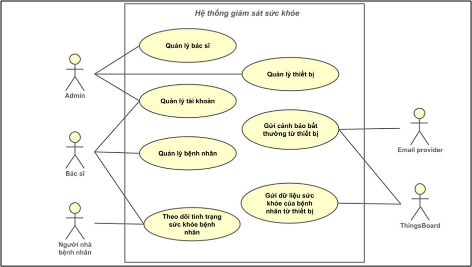

#### Quy tắc nghiệp vụ (Business Rules)

- **BR-01 (Liên kết thiết bị 1–1):** Một bệnh nhân tại một thời điểm chỉ được liên kết tối đa 1 thiết bị (`patient.deviceId`), và một thiết bị không được gán cho nhiều bệnh nhân.
- **BR-02 (Điều kiện xem telemetry):** Chỉ khi bệnh nhân có `deviceId` hợp lệ thì mới có thể truy vấn telemetry.
- **BR-03 (Phân quyền):** Admin chỉ thao tác nghiệp vụ quản trị (bác sĩ/thiết bị); Doctor thao tác bệnh nhân/thiết bị; Patient chỉ xem thông tin của chính mình.
- **BR-04 (Nguồn dữ liệu telemetry):** Telemetry được truy vấn từ ThingsBoard (timeseries). MongoDB chỉ lưu dữ liệu nghiệp vụ.
- **BR-05 (Upload avatar):** Chỉ nhận file ảnh, giới hạn dung lượng; sau upload lưu URL vào user.

#### Mô tả chi tiết use case

#### UC-A01: Đăng nhập hệ thống

- **Tác nhân:** Admin/Doctor/Patient
- **Mục tiêu:** Người dùng đăng nhập để sử dụng hệ thống theo vai trò.
- **Tiền điều kiện:** Tài khoản tồn tại và chưa bị vô hiệu hóa (nếu có cơ chế).
- **Luồng chính:**
  1. Người dùng nhập **username** và mật khẩu trên web. (Trong dự án hiện tại, `username` thường là **CCCD**; riêng admin có thể dùng `admin`.)
  2. Web gửi yêu cầu `POST /auth/login` tới backend.
  3. Backend xác thực thông tin (so khớp mật khẩu đã hash).
  4. Backend trả về thông tin user + **access token** + **refresh token**.
  5. (Nội bộ backend) Sau khi đăng nhập thành công, backend **cố gắng** đăng nhập ThingsBoard (admin dùng admin credentials, doctor/patient dùng tenant credentials) và cache token TB theo user; nếu ThingsBoard lỗi thì **không chặn** đăng nhập.
  6. Web lưu token và điều hướng đến màn hình phù hợp role.
- **Hậu điều kiện:** Phiên đăng nhập hợp lệ được thiết lập.
- **Ngoại lệ/luồng thay thế:**
  - A1: Sai thông tin → trả lỗi xác thực.
  - A2: Vượt giới hạn rate limit → trả lỗi giới hạn tần suất.
  - A3: Tài khoản không tồn tại → trả lỗi `User not found`.

#### UC-A02: Làm mới phiên (refresh token)

- **Tác nhân:** Admin/Doctor/Patient
- **Mục tiêu:** Lấy access token mới để tiếp tục sử dụng hệ thống khi access token hết hạn.
- **Tiền điều kiện:** Có refresh token còn hiệu lực.
- **Luồng chính:**
  1. Web gọi `POST /auth/refresh`.
  2. Backend xác thực refresh token.
  3. Backend trả **access token mới và refresh token mới** (refresh token cũ bị vô hiệu theo tokenId).
- **Hậu điều kiện:** Web nhận access token mới và tiếp tục gọi các API yêu cầu xác thực.
- **Ngoại lệ/luồng thay thế:** Refresh token hết hạn/không hợp lệ → backend trả lỗi, web yêu cầu đăng nhập lại.

#### UC-A03: Đăng xuất

- **Tác nhân:** Admin/Doctor/Patient
- **Mục tiêu:** Kết thúc phiên sử dụng và giảm rủi ro lộ token.
- **Tiền điều kiện:** Người dùng đang đăng nhập.
- **Luồng chính:**
  1. Người dùng chọn “Đăng xuất” trên web.
  2. Web xóa access token/refresh token khỏi bộ nhớ lưu trữ (localStorage/cookie tùy triển khai).
  3. Web gọi `POST /auth/logout` (kèm `Authorization: Bearer <access_token>`; `refresh_token` là tùy chọn) để backend thu hồi refresh token (nếu decode được) và revoke các token đang lưu theo user.
  4. Web điều hướng về màn hình đăng nhập.
- **Hậu điều kiện:** Người dùng không còn truy cập được các API yêu cầu xác thực.
- **Ngoại lệ/luồng thay thế:** Mạng lỗi khi gọi API thu hồi token (nếu có) → vẫn đăng xuất phía client.

#### UC-A04: Đổi mật khẩu

- **Tác nhân:** Admin/Doctor/Patient
- **Mục tiêu:** Cập nhật mật khẩu mới theo chính sách bảo mật.
- **Tiền điều kiện:** Người dùng biết mật khẩu hiện tại. (Theo triển khai hiện tại, endpoint đổi mật khẩu hoạt động theo `{ username, oldPassword, newPassword }` và **không yêu cầu** access token.)
- **Luồng chính:**
  1. Người dùng nhập mật khẩu hiện tại và mật khẩu mới.
  2. Web gọi API đổi mật khẩu tới backend.
  3. Backend kiểm tra mật khẩu hiện tại, kiểm tra chính sách mật khẩu mới.
  4. Backend hash mật khẩu mới và cập nhật vào MongoDB.
  5. Backend trả kết quả thành công; web hiển thị thông báo.
- **Hậu điều kiện:** Mật khẩu mới có hiệu lực; (tùy chính sách) phiên đăng nhập khác có thể bị buộc đăng xuất.
- **Ngoại lệ/luồng thay thế:** Sai mật khẩu hiện tại; mật khẩu mới không đạt chính sách.

#### UC-B01: Admin quản lý bác sĩ (CRUD)

- **Tác nhân:** Admin
- **Mục tiêu:** Quản trị danh sách bác sĩ (tạo mới, xem, cập nhật, xóa) để phục vụ vận hành hệ thống.
- **Tiền điều kiện:** Admin đã đăng nhập.
- **Luồng chính (tổng quát):**
  1. Admin vào màn hình quản lý bác sĩ.
  2. Admin thực hiện tạo/xem/sửa/xóa.
  3. Web gọi các API `/admin/doctors` tương ứng.
  4. Backend kiểm tra quyền, validate dữ liệu, thao tác MongoDB.
  5. Web cập nhật danh sách/chi tiết sau thao tác.
- **Hậu điều kiện:** Thông tin bác sĩ được cập nhật nhất quán trên MongoDB; giao diện phản ánh dữ liệu mới.
- **Ngoại lệ/luồng thay thế:** Thiếu quyền; dữ liệu không hợp lệ; trùng định danh (nếu có).

#### UC-B02: Admin xem danh sách thiết bị

- **Tác nhân:** Admin
- **Mục tiêu:** Theo dõi/vận hành thiết bị đã đăng ký, trạng thái liên kết và các thông tin cơ bản.
- **Tiền điều kiện:** Admin đã đăng nhập.
- **Luồng chính:**
  1. Admin mở màn hình “Devices”.
  2. Web gọi API lấy danh sách thiết bị.
  3. Backend kiểm tra quyền, truy vấn dữ liệu thiết bị (từ MongoDB và/hoặc ThingsBoard tùy thiết kế).
  4. Web hiển thị danh sách thiết bị.
- **Hậu điều kiện:** Admin xem được danh sách thiết bị phục vụ giám sát/vận hành.
- **Ngoại lệ/luồng thay thế:** Thiếu quyền; lỗi truy cập dữ liệu/ThingsBoard.

#### UC-C01: Bác sĩ xem/cập nhật hồ sơ cá nhân

- **Tác nhân:** Doctor
- **Mục tiêu:** Bác sĩ xem và cập nhật thông tin cá nhân (profile).
- **Tiền điều kiện:** Bác sĩ đã đăng nhập.
- **Luồng chính:**
  1. Bác sĩ mở màn hình profile.
  2. Web gọi API lấy thông tin bác sĩ.
  3. Bác sĩ chỉnh sửa và bấm lưu.
  4. Web gọi API cập nhật; backend validate và cập nhật MongoDB.
  5. Web hiển thị thông tin mới.
- **Hậu điều kiện:** Hồ sơ bác sĩ được cập nhật trong MongoDB và hiển thị chính xác trên web.
- **Ngoại lệ/luồng thay thế:** Dữ liệu không hợp lệ; lỗi cập nhật DB.

#### UC-C02: Bác sĩ quản lý bệnh nhân (CRUD)

- **Tác nhân:** Doctor
- **Mục tiêu:** Tạo/xem/sửa/xóa hồ sơ bệnh nhân thuộc phạm vi quản lý.
- **Tiền điều kiện:** Bác sĩ đã đăng nhập.
- **Luồng chính (tổng quát):**
  1. Bác sĩ vào màn hình quản lý bệnh nhân.
  2. Thực hiện tạo/xem/sửa/xóa hồ sơ.
  3. Web gọi các API bệnh nhân tương ứng.
  4. Backend kiểm tra quyền, validate dữ liệu và thao tác MongoDB.
  5. Web cập nhật danh sách/chi tiết sau thao tác.
- **Hậu điều kiện:** Dữ liệu bệnh nhân được cập nhật nhất quán trên MongoDB.
- **Ngoại lệ/luồng thay thế:** Thiếu quyền; dữ liệu không hợp lệ; xóa thất bại do ràng buộc liên kết thiết bị (nếu áp dụng).

#### UC-C03: Bác sĩ cấp phát thiết bị cho bệnh nhân (allocate)

- **Tác nhân:** Doctor
- **Mục tiêu:** Liên kết thiết bị ThingsBoard với hồ sơ bệnh nhân để bắt đầu theo dõi telemetry.
- **Tiền điều kiện:**
  - Bệnh nhân tồn tại.
  - Bệnh nhân chưa có `deviceId`.
  - Thiết bị đã được khai báo trên ThingsBoard và có attribute `patient` khớp CCCD bệnh nhân.
- **Luồng chính:**
  1. Bác sĩ chọn bệnh nhân và thao tác “Allocate device”.
  2. Web gọi `POST /doctor/patients/{patient_id}/allocate-device`.
  3. Backend lấy token ThingsBoard (đăng nhập tenant hoặc dùng token còn hạn).
  4. Backend tìm thiết bị trên ThingsBoard theo attribute `patient` (CCCD).
  5. Backend cập nhật `patient.deviceId` và tạo bản ghi `device` trong MongoDB.
  6. Backend trả về `device_id`; web hiển thị trạng thái đã cấp phát.
- **Hậu điều kiện:** Bệnh nhân được liên kết thiết bị; dữ liệu liên kết được lưu.
- **Luồng thay thế/ngoại lệ:**
  - C3-1: Không tìm thấy device theo CCCD → trả lỗi “No device found”.
  - C3-2: Bệnh nhân đã có thiết bị → trả lỗi nghiệp vụ.
  - C3-3: ThingsBoard không truy cập được / token lỗi → trả lỗi dịch vụ.

#### UC-C04: Bác sĩ thu hồi thiết bị (recall)

- **Tác nhân:** Doctor
- **Mục tiêu:** Hủy liên kết bệnh nhân–thiết bị khi bệnh nhân ngừng theo dõi hoặc đổi thiết bị.
- **Tiền điều kiện:** Bệnh nhân đang có `deviceId`.
- **Luồng chính:**
  1. Bác sĩ thao tác “Recall device”.
  2. Web gọi `POST /doctor/patients/{patient_id}/recall-device`.
  3. Backend xóa liên kết `patient.deviceId` và xóa bản ghi `device` trong MongoDB.
  4. (Tùy điều kiện token) backend có thể yêu cầu xóa device trên ThingsBoard.
  5. Web cập nhật trạng thái bệnh nhân.
- **Hậu điều kiện:** `patient.deviceId` được gỡ bỏ; bản ghi device trong MongoDB được cập nhật/xóa theo thiết kế.
- **Ngoại lệ/luồng thay thế:** Bệnh nhân chưa có device; ThingsBoard lỗi khi xóa.

#### UC-C05: Bác sĩ xem chỉ số sức khỏe bệnh nhân

- **Tác nhân:** Doctor
- **Mục tiêu:** Theo dõi các chỉ số sức khỏe mới nhất của bệnh nhân để ra quyết định kịp thời.
- **Tiền điều kiện:** Bệnh nhân có `deviceId` hợp lệ.
- **Luồng chính:**
  1. Bác sĩ mở trang chi tiết bệnh nhân.
  2. Web gọi `GET /doctor/patients/{patient_id}/health`.
  3. Backend gọi ThingsBoard API lấy telemetry timeseries của device.
  4. Backend parse giá trị mới nhất (heart_rate, SpO₂, temperature, alarm) và trả về.
  5. Web hiển thị số liệu và trạng thái.
- **Hậu điều kiện:** Bác sĩ xem được dữ liệu telemetry mới nhất tại thời điểm truy vấn.
- **Ngoại lệ/luồng thay thế:** Bệnh nhân chưa được cấp phát thiết bị; ThingsBoard không truy cập được.

#### UC-E01: ThingsBoard gửi alarm và hệ thống phát cảnh báo

- **Tác nhân:** ThingsBoard, Doctor
- **Mục tiêu:** Phát hiện bất thường và thông báo cho bác sĩ gần thời gian thực.
- **Tiền điều kiện:** Rule Chain đã cấu hình; bệnh nhân đã liên kết `deviceId`.
- **Luồng chính:**
  1. ESP32 gửi telemetry lên ThingsBoard.
  2. Rule Chain phát hiện bất thường và tạo alarm.
  3. ThingsBoard gọi webhook `POST /thingsboard/alarm` tới backend.
  4. Backend xác định bệnh nhân theo `deviceId` và xác định bác sĩ phụ trách.
  5. Backend phát Socket.IO tới client bác sĩ và gửi email cảnh báo.
  6. Web hiển thị cảnh báo realtime.
- **Hậu điều kiện:** Cảnh báo được gửi tới đúng bác sĩ.
- **Ngoại lệ/luồng thay thế:** Không tìm thấy bệnh nhân theo deviceId; lỗi gửi email; bác sĩ offline (socket không nhận).

#### UC-D02: Bệnh nhân xem chỉ số sức khỏe của bản thân

- **Tác nhân:** Patient
- **Mục tiêu:** Bệnh nhân/người nhà theo dõi sức khỏe của chính mình qua các chỉ số mới nhất.
- **Tiền điều kiện:** Bệnh nhân đã đăng nhập; tài khoản patient có hồ sơ và (nếu có) đã được liên kết device.
- **Luồng chính:** Patient gọi `GET /family/health` → backend xác định patient theo `userId` → lấy telemetry từ ThingsBoard → trả về cho web.
- **Hậu điều kiện:** Web hiển thị các chỉ số sức khỏe mới nhất của bệnh nhân.
- **Ngoại lệ/luồng thay thế:** Chưa có device; ThingsBoard lỗi.

#### UC-D01: Bệnh nhân xem thông tin cá nhân

- **Tác nhân:** Patient
- **Mục tiêu:** Bệnh nhân xem thông tin hồ sơ của chính mình.
- **Tiền điều kiện:** Bệnh nhân đã đăng nhập.
- **Luồng chính:**
  1. Patient mở trang hồ sơ.
  2. Web gọi API lấy thông tin hồ sơ theo user hiện tại.
  3. Backend xác định patient theo `userId` và trả dữ liệu hồ sơ.
  4. Web hiển thị thông tin.
- **Hậu điều kiện:** Bệnh nhân xem được thông tin hồ sơ hiện tại.
- **Ngoại lệ/luồng thay thế:** Không tìm thấy hồ sơ patient; lỗi truy vấn DB.

#### UC-F01: Người dùng upload avatar

- **Tác nhân:** Admin/Doctor/Patient
- **Mục tiêu:** Cập nhật ảnh đại diện của người dùng để hiển thị trên hệ thống.
- **Tiền điều kiện:** Người dùng đã đăng nhập; file là ảnh hợp lệ.
- **Luồng chính:**
  1. Người dùng chọn file ảnh.
  2. Web gửi `POST /user/upload-image` (multipart/form-data).
  3. Backend kiểm tra định dạng/dung lượng, xử lý ảnh (nếu có) và upload lên AWS S3.
  4. Backend cập nhật `user.imageUrl` trong MongoDB và trả URL.
  5. Web hiển thị avatar mới.
- **Hậu điều kiện:** Ảnh được lưu trên S3 và URL avatar được cập nhật trong MongoDB.
- **Ngoại lệ/luồng thay thế:** File không hợp lệ; upload S3 lỗi; user không tồn tại.

#### UC-F02: Người dùng xem/tải avatar

- **Tác nhân:** Admin/Doctor/Patient
- **Mục tiêu:** Hiển thị ảnh đại diện hiện tại của người dùng trên web.
- **Tiền điều kiện:** Người dùng đã đăng nhập.
- **Luồng chính:**
  1. Web lấy thông tin user (hoặc endpoint chuyên biệt) để nhận `imageUrl`.
  2. Web dùng `imageUrl` để hiển thị avatar.
  3. (Tùy chọn) Người dùng có thể mở ảnh ở tab mới để tải xuống.
- **Hậu điều kiện:** Avatar hiển thị đúng theo URL đã lưu.
- **Ngoại lệ/luồng thay thế:** `imageUrl` rỗng → hiển thị avatar mặc định; URL lỗi/không truy cập được.

## 3.4 Mô hình hóa cấu trúc

### 3.4.1 Xác định các đối tượng của hệ thống

Các đối tượng chính (ở mức phân tích) gồm: **User**, **Doctor**, **Patient**, **Device**, **Telemetry/HealthInfo**, **Alarm/Notification**, **Avatar**.

### 3.4.2 Mô hình hóa lĩnh vực

Quan hệ nghiệp vụ cốt lõi:

- User gắn với đúng một role (admin/doctor/patient).
- Doctor và Patient đều liên kết tới User.
- Patient (tại một thời điểm) liên kết tối đa một Device thông qua `deviceId`.
- Telemetry/Alarm gắn với Device (do ThingsBoard quản lý), backend sử dụng để truy vết Patient/Doctor.

## 3.5 Mô hình hóa hành vi

### 3.5.1 Sơ đồ máy trạng thái

Trong phạm vi báo cáo, sơ đồ máy trạng thái có thể mô tả trạng thái vận hành của thiết bị và kết nối (ví dụ: `Boot` → `WiFiConnecting` → `Operational` → `Reconnecting` → `Offline`). Phần minh họa chi tiết có thể trình bày ở chương firmware.

### 3.5.2 Sơ đồ tuần tự (Sequence Diagram) cho các luồng quan trọng

Mục này cung cấp **Sequence Diagram** để minh họa các luồng quan trọng, tránh trùng lặp với phần đặc tả use case (đã có luồng thay thế/ngoại lệ).

#### Bộ Sequence Diagram đầy đủ

**Sequence Diagram – UC-A01 Đăng nhập**

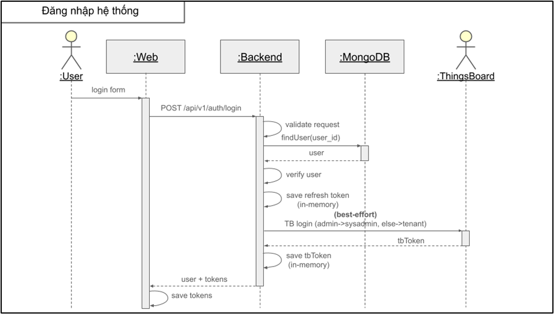

**Sequence Diagram – UC-A02 Refresh token**

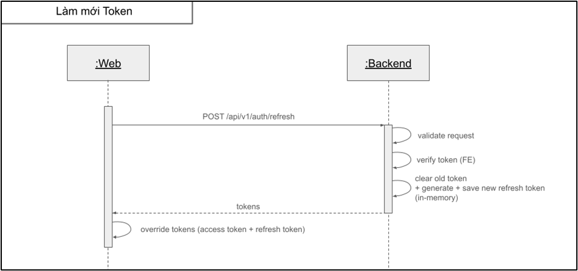

**Sequence Diagram – UC-A03 Đăng xuất**

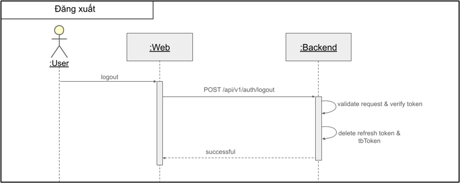

**Sequence Diagram – UC-A04 Đổi mật khẩu**

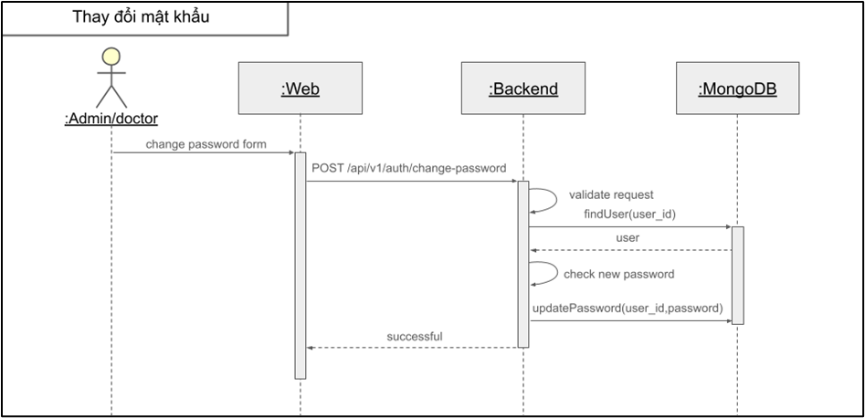

**Sequence Diagram – UC-B01 Admin CRUD bác sĩ**

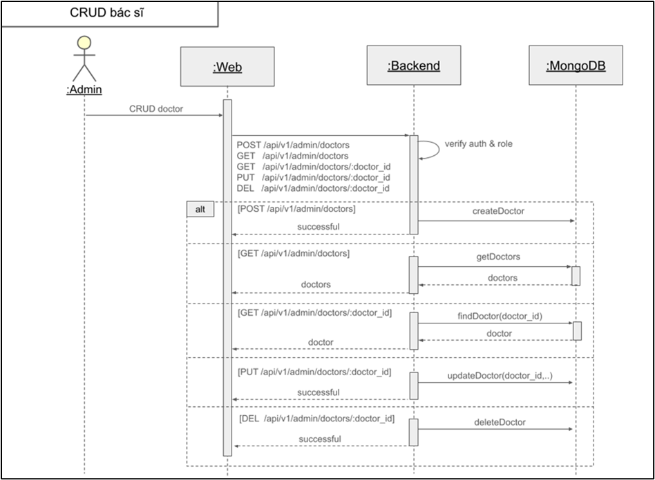

**Sequence Diagram – UC-B02 Admin xem danh sách thiết bị**

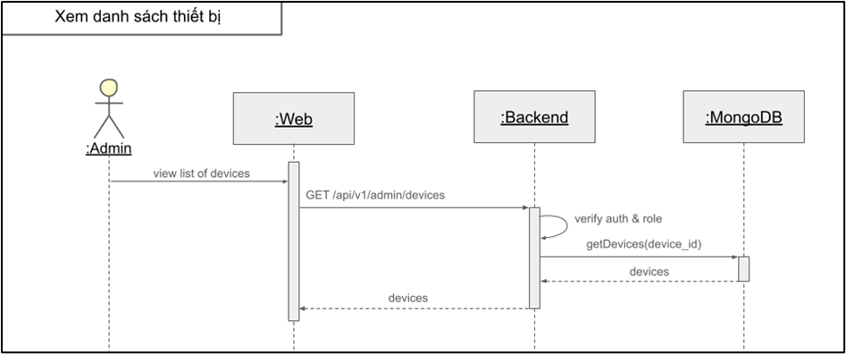

**Sequence Diagram – UC-C01 Doctor xem/cập nhật profile**

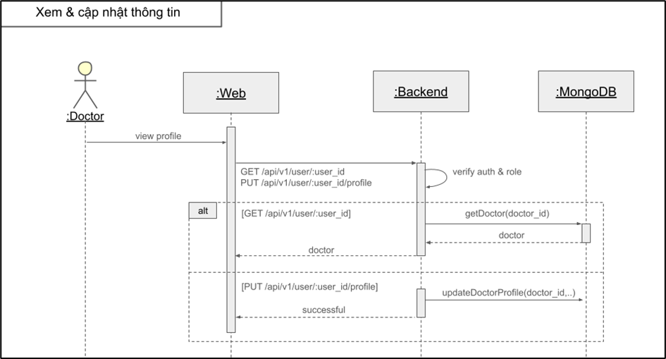

**Sequence Diagram – UC-C02 Doctor CRUD bệnh nhân**

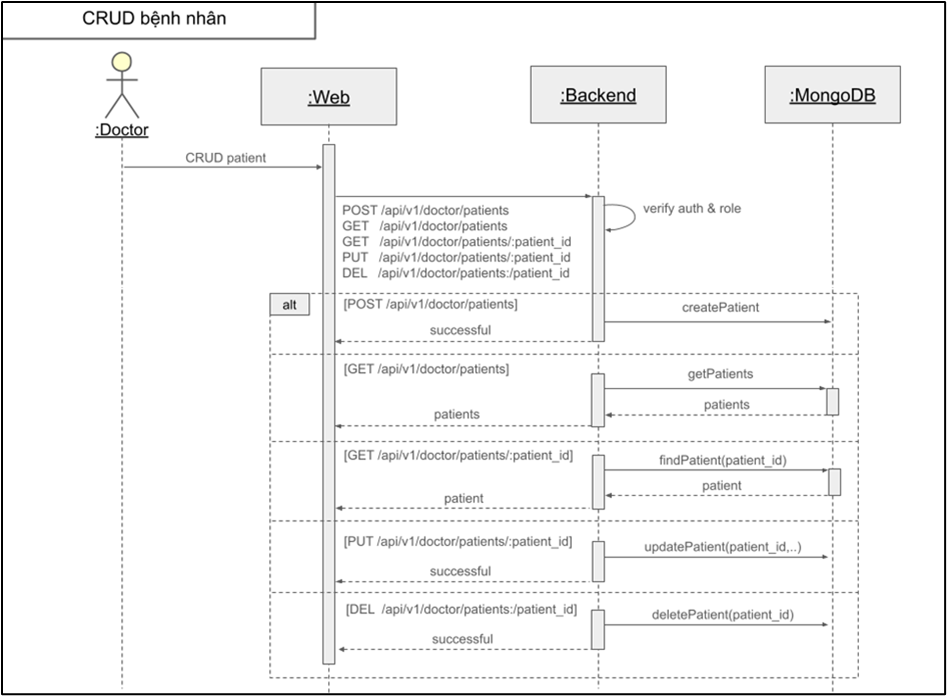

**Sequence Diagram – UC-C03 Allocate device**

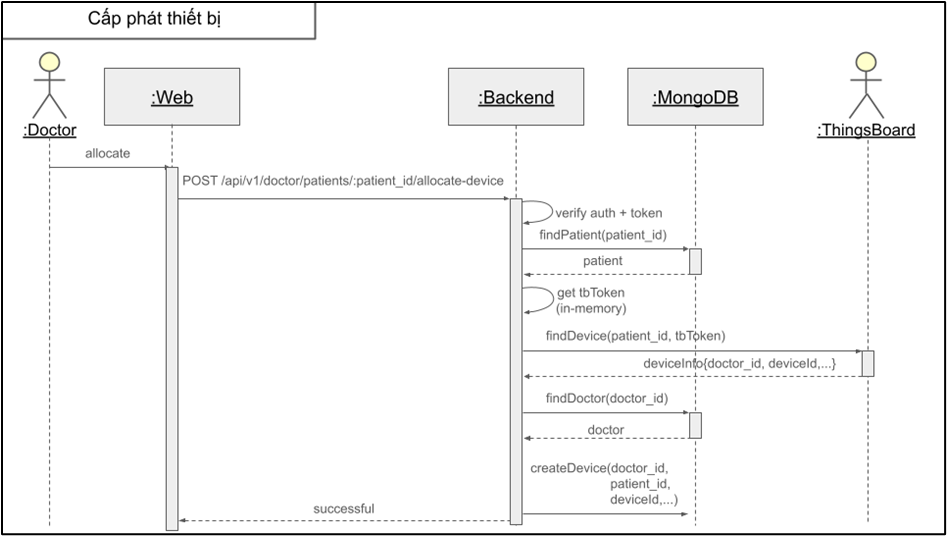

**Sequence Diagram – UC-C04 Recall device**

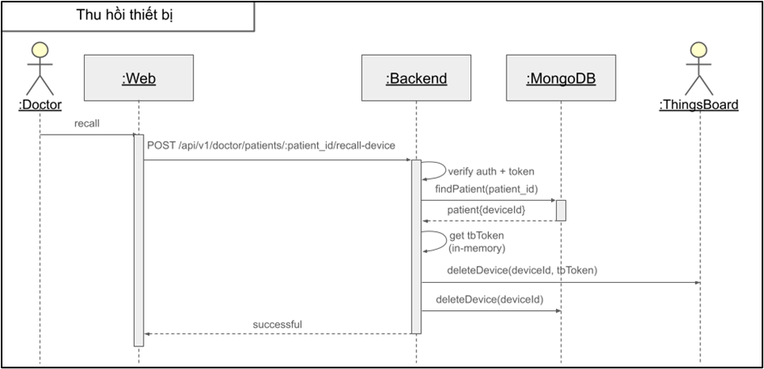

**Sequence Diagram – UC-C05 Doctor xem chỉ số sức khỏe bệnh nhân**

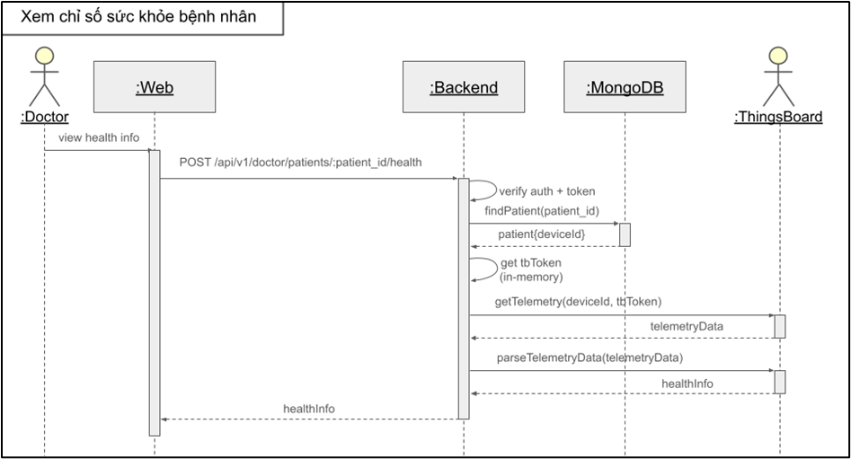

**Sequence Diagram – UC-D01 Người nhà xem thông tin bệnh nhân**

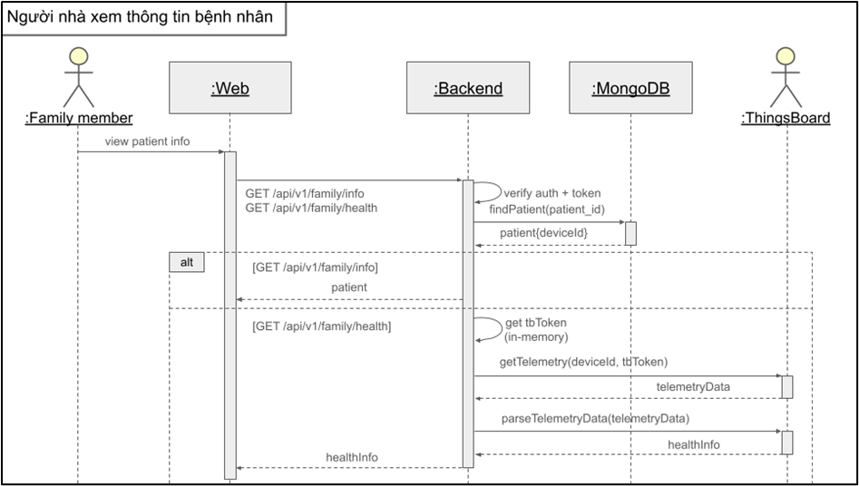

**Sequence Diagram – UC-E01 ThingsBoard gửi alarm & hệ thống phát cảnh báo**

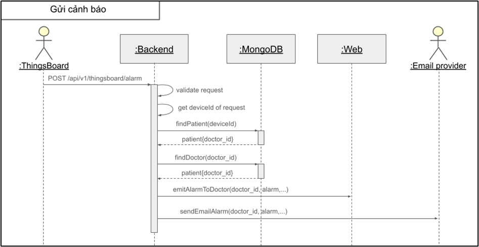
