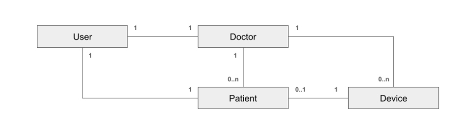
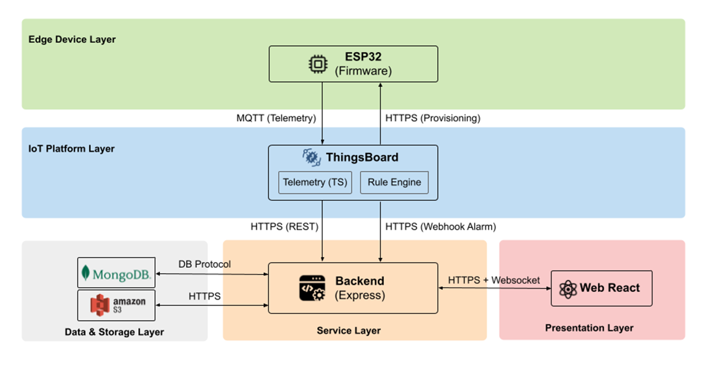

# Chương 4. Thiết kế hệ thống

> Chương này mô tả thiết kế tổng thể của hệ thống "Smart Health Monitoring and Warning System" dựa trên hiện trạng triển khai trong repo: ESP32 (ESP-IDF) gửi dữ liệu lên ThingsBoard qua MQTT; Backend Node.js/Express làm lớp nghiệp vụ (quản lý người dùng/bệnh nhân/bác sĩ/thiết bị), lấy telemetry từ ThingsBoard để hiển thị; Web React hiển thị dữ liệu và nhận cảnh báo realtime qua Socket.IO; ảnh đại diện lưu trên AWS S3.

---

## 4.1 Thiết kế lưu trữ cố định

### 4.1.1 Tổng quan lưu trữ

Hệ thống sử dụng mô hình lưu trữ “lai”:

- **Thiết bị IoT (ESP32)**: đọc cảm biến (nhịp tim/SpO₂/nhiệt độ, ngã…), xử lý cảnh báo tại chỗ, gửi telemetry/attributes lên ThingsBoard.
- **Nền tảng IoT (ThingsBoard)**: nhận MQTT telemetry, lưu time-series, rule engine phát hiện bất thường và phát webhook về backend.
- **Backend (Node.js/Express)**: cung cấp API cho web, quản lý tài khoản và hồ sơ, tích hợp ThingsBoard (đăng nhập tenant, đọc telemetry/attributes, xóa thiết bị), xử lý webhook alarm và phát thông báo realtime/email.
- **CSDL nghiệp vụ (MongoDB)**: lưu thực thể nghiệp vụ (User/Doctor/Patient/Device).
- **Web (React)**: giao diện cho Admin/Bác sĩ/Bệnh nhân; hiển thị danh sách bệnh nhân, chi tiết bệnh nhân, cảnh báo realtime.

- **MongoDB**: lưu dữ liệu nghiệp vụ, quan hệ quản lý (User/Doctor/Patient/Device).
- **ThingsBoard (time-series)**: lưu telemetry theo thời gian và các attributes của thiết bị.
- **AWS S3**: lưu file ảnh đại diện; MongoDB chỉ lưu URL.

### 4.1.2 ERD (mô tả)

- **User (1) — (1) Doctor**: mỗi bác sĩ có một tài khoản đăng nhập.
- **User (1) — (1) Patient**: mỗi bệnh nhân có một tài khoản đăng nhập.
- **Doctor (1) — (0..n) Patient**: một bác sĩ phụ trách nhiều bệnh nhân (tham chiếu qua `Patient.doctorId`).
- **Doctor (1) — (0..n) Device**: một bác sĩ phụ trách nhiều bệnh nhân (tham chiếu qua `Doctor.doctorId`).
- **Patient (1) — (0..1) Device**: mỗi bệnh nhân có thể được cấp một thiết bị (qua `Patient.deviceId`).

#### Sơ đồ ERD (tối giản)



### 4.1.3 Thiết kế collection MongoDB

#### a) Collection `users`

- **Mục đích**: Lưu trữ tài khoản đăng nhập, thông tin phân quyền và ảnh đại diện.

| Trường      | Kiểu dữ liệu | Mô tả                                         |
| :---------- | :----------- | :-------------------------------------------- |
| `username`  | String       | Tên đăng nhập (duy nhất), thường dùng CCCD.   |
| `password`  | String       | Mật khẩu đã được mã hóa (bcrypt).             |
| `role`      | String       | Quyền hạn: `admin`, `doctor`, `patient`.      |
| `imageUrl`  | String       | Đường dẫn (URL) ảnh đại diện lưu trên AWS S3. |
| `createdAt` | Date         | Thời điểm tạo bản ghi.                        |
| `updatedAt` | Date         | Thời điểm cập nhật bản ghi.                   |

#### b) Collection `doctors`

- **Mục đích**: Lưu trữ hồ sơ chi tiết của bác sĩ.

| Trường           | Kiểu dữ liệu | Mô tả                                  |
| :--------------- | :----------- | :------------------------------------- |
| `userId`         | ObjectId     | Tham chiếu tới `users._id` (duy nhất). |
| `cccd`           | String       | Số Căn cước công dân (duy nhất).       |
| `full_name`      | String       | Họ và tên bác sĩ.                      |
| `email`          | String       | Địa chỉ email liên lạc.                |
| `birthday`       | Date         | Ngày sinh.                             |
| `address`        | String       | Địa chỉ thường trú.                    |
| `phone`          | String       | Số điện thoại.                         |
| `specialization` | String       | Chuyên môn/Khoa công tác.              |
| `createdAt`      | Date         | Thời điểm tạo bản ghi.                 |
| `updatedAt`      | Date         | Thời điểm cập nhật bản ghi.            |

#### c) Collection `patients`

- **Mục đích**: Lưu trữ hồ sơ bệnh nhân và liên kết với bác sĩ phụ trách cùng thiết bị đo.

| Trường      | Kiểu dữ liệu | Mô tả                                             |
| :---------- | :----------- | :------------------------------------------------ |
| `userId`    | ObjectId     | Tham chiếu tới `users._id` (duy nhất).            |
| `cccd`      | String       | Số Căn cước công dân (12 ký tự, duy nhất).        |
| `full_name` | String       | Họ và tên bệnh nhân.                              |
| `birthday`  | Date         | Ngày sinh.                                        |
| `address`   | String       | Địa chỉ thường trú.                               |
| `phone`     | String       | Số điện thoại.                                    |
| `room`      | String       | Số phòng bệnh.                                    |
| `doctorId`  | ObjectId     | Tham chiếu tới `users._id` của bác sĩ phụ trách.  |
| `deviceId`  | String       | ID thiết bị trên ThingsBoard (null nếu chưa cấp). |
| `createdAt` | Date         | Thời điểm tạo bản ghi.                            |
| `updatedAt` | Date         | Thời điểm cập nhật bản ghi.                       |

#### d) Collection `devices`

- **Mục đích**: Quản lý liên kết giữa thiết bị ThingsBoard và các thực thể nghiệp vụ.

| Trường        | Kiểu dữ liệu | Mô tả                                              |
| :------------ | :----------- | :------------------------------------------------- |
| `name`        | String       | Tên hiển thị của thiết bị (duy nhất).              |
| `deviceId`    | String       | ID định danh thiết bị trên ThingsBoard (duy nhất). |
| `doctorCCCD`  | String       | CCCD của bác sĩ quản lý thiết bị.                  |
| `patientCCCD` | String       | CCCD của bệnh nhân đang sử dụng thiết bị.          |
| `doctorId`    | ObjectId     | Tham chiếu tới `doctors._id`.                      |
| `patientId`   | ObjectId     | Tham chiếu tới `patients._id`.                     |
| `createdAt`   | Date         | Thời điểm tạo bản ghi.                             |
| `updatedAt`   | Date         | Thời điểm cập nhật bản ghi.                        |

#### e) “Notification/Alarm”

- Hiện tại backend **không có collection Notification/Alarm**.
- Khi ThingsBoard phát hiện bất thường, backend xử lý webhook và **gửi realtime/email**, không lưu lịch sử alarm vào MongoDB.

---

## 4.2 Thiết kế kiến trúc tổng thể (ESP32 ↔ MQTT/HTTP ↔ Backend ↔ DB ↔ Web)

### 4.2.1 Mô hình kiến trúc (logical view)

Hệ thống được chia thành 5 khối chính:

- **Thiết bị IoT (ESP32)**: đọc cảm biến (nhịp tim/SpO₂/nhiệt độ, ngã…), xử lý cảnh báo tại chỗ, gửi telemetry/attributes lên ThingsBoard.
- **Nền tảng IoT (ThingsBoard)**: nhận MQTT telemetry, lưu time-series, rule engine phát hiện bất thường và phát webhook về backend.
- **Backend (Node.js/Express)**: cung cấp API cho web, quản lý tài khoản và hồ sơ, tích hợp ThingsBoard (đăng nhập tenant, đọc telemetry/attributes, xóa thiết bị), xử lý webhook alarm và phát thông báo realtime/email.
- **CSDL nghiệp vụ (MongoDB)**: lưu thực thể nghiệp vụ (User/Doctor/Patient/Device).
- **Web (React)**: giao diện cho Admin/Bác sĩ/Bệnh nhân; hiển thị danh sách bệnh nhân, chi tiết bệnh nhân, cảnh báo realtime.

### 4.2.2 Sơ đồ kiến trúc



### 4.2.1 Luồng dữ liệu chính

- **Luồng đo chỉ số**: ESP32 → ThingsBoard qua **MQTT**.
- **Luồng xem chỉ số trên web**: Web → Backend qua **HTTP**; Backend → ThingsBoard qua **HTTP (REST)**.
- **Luồng cảnh báo**: ThingsBoard → Backend qua **HTTP (webhook)**; Backend → Web qua **WebSocket (Socket.IO)** và gửi email qua **SMTP**.
- **Luồng ảnh đại diện**: Web → Backend qua **HTTP (upload)**; Backend → S3 qua **HTTP(S)**; Backend cập nhật URL vào MongoDB.

---

## 4.5 Thiết kế giao tiếp & dữ liệu truyền

### 4.5.1 MQTT/HTTP giữa ESP32 và ThingsBoard

#### a) Provisioning (HTTP)

ESP32 đăng ký thiết bị lên ThingsBoard qua provisioning endpoint:

- **URL**: `http://demo.thingsboard.io/api/v1/provision`
- **Request JSON**:

```json
{
  "deviceName": "ESP_A1B2C3D4E5F6",
  "provisionDeviceKey": "<PROVISION_KEY>",
  "provisionDeviceSecret": "<PROVISION_SECRET>"
}
```

- **Response**: trả về `credentialsValue` (access token) để dùng làm MQTT username.
- **Lưu trữ trên thiết bị**: token được lưu trong NVS (`NVS_KEY_TOKEN`).

#### b) MQTT topics

- Telemetry: `v1/devices/me/telemetry`
- Attributes: `v1/devices/me/attributes`
- Attribute request (OTA): `v1/devices/me/attributes/request/1`
- Attribute response (OTA): `v1/devices/me/attributes/response/+`

#### c) Payload telemetry (mẫu theo firmware)

Firmware publish JSON:

```json
{
  "heartRate": 78,
  "SpO2": 97.5,
  "temperature": 36.8,
  "alarm": "normal"
}
```

- `alarm` có thể là: `normal`, `sos`, `fall`, `heart_rate_high`, ... (phụ thuộc module cảnh báo).

Lưu ý triển khai:

- Backend khi đọc telemetry từ ThingsBoard đang cấu hình key **`heart_rate`** (snake_case) thay vì `heartRate` (camelCase). Để đồng bộ end-to-end, cần **thống nhất key telemetry** (sửa firmware, hoặc cấu hình rule chain/transform trên ThingsBoard).

#### d) Payload attributes (mẫu)

Firmware publish attributes để gắn thiết bị với CCCD:

```json
{
  "patientID": "012345678901",
  "doctorID": "012345678901"
}
```

Lưu ý triển khai:

- Backend hiện tìm thiết bị theo attributes keys `patient` và `doctor` (không phải `patientID`/`doctorID`). Vì vậy khi triển khai thực tế cần thống nhất key attributes (sửa firmware hoặc đổi cấu hình backend/ThingsBoard).

#### e) OTA (thiết kế dựa trên firmware)

- Thiết bị định kỳ publish request shared attributes: `{"sharedKeys":"fw_title,fw_version"}` lên `v1/devices/me/attributes/request/1`.
- Khi nhận response, thiết bị so sánh `fw_version` với version hiện tại.
- Nếu cần update, thiết bị tải firmware qua HTTPS:
  - `https://demo.thingsboard.io/api/v1/<device_access_token>/firmware?title=<fw_title>&version=<fw_version>`
- Telemetry trạng thái OTA được publish lên `v1/devices/me/telemetry`:
  - `{"fw_state":"UPDATING"}` → `UPDATED` hoặc `FAILED`.

### 4.5.2 API Backend (HTTP/REST)

#### a) Quy ước chung

- **Base path**: `/api/v1`
- **Auth**: `Authorization: Bearer <access_token>`
- **Phân quyền**: dựa trên `role` trong JWT (`admin`, `doctor`, `patient`).

#### b) Danh sách endpoint chính (theo routes triển khai)

Bảng dưới đây mô tả các endpoint quan trọng. (Request/response rút gọn ở mức thiết kế.)

| Nhóm       | Method | Path                                           | Quyền                    | Mục đích                            |
| ---------- | ------ | ---------------------------------------------- | ------------------------ | ----------------------------------- |
| Health     | GET    | `/health`                                      | Public                   | Kiểm tra API sống                   |
| Auth       | POST   | `/auth/login`                                  | Public                   | Đăng nhập                           |
| Auth       | POST   | `/auth/refresh`                                | Public                   | Làm mới access token                |
| Auth       | POST   | `/auth/logout`                                 | Auth                     | Đăng xuất                           |
| Auth       | POST   | `/auth/change-password`                        | Public (theo triển khai) | Đổi mật khẩu                        |
| Admin      | POST   | `/admin/doctors`                               | Admin                    | Tạo bác sĩ                          |
| Admin      | GET    | `/admin/doctors`                               | Admin                    | Danh sách bác sĩ                    |
| Admin      | GET    | `/admin/doctors/:doctor_id`                    | Admin                    | Chi tiết bác sĩ                     |
| Admin      | PUT    | `/admin/doctors/:doctor_id`                    | Admin                    | Cập nhật bác sĩ                     |
| Admin      | DELETE | `/admin/doctors/:doctor_id`                    | Admin                    | Xóa bác sĩ                          |
| Admin      | GET    | `/admin/devices`                               | Admin                    | Danh sách thiết bị                  |
| Admin      | GET    | `/admin/user/:user_id`                         | Auth                     | Lấy hồ sơ bác sĩ theo userId        |
| Admin      | PUT    | `/admin/user/:user_id/profile`                 | Doctor                   | Bác sĩ cập nhật hồ sơ của mình      |
| Doctor     | GET    | `/doctor/info`                                 | Doctor                   | Lấy hồ sơ bác sĩ hiện tại           |
| Doctor     | PUT    | `/doctor/info`                                 | Doctor                   | Cập nhật hồ sơ bác sĩ               |
| Doctor     | GET    | `/doctor/doctors-list`                         | Doctor                   | Lấy danh sách bác sĩ (phục vụ form) |
| Doctor     | POST   | `/doctor/patients`                             | Doctor                   | Tạo bệnh nhân                       |
| Doctor     | GET    | `/doctor/patients`                             | Doctor                   | Danh sách bệnh nhân                 |
| Doctor     | GET    | `/doctor/patients/:patient_id`                 | Doctor                   | Chi tiết bệnh nhân                  |
| Doctor     | PUT    | `/doctor/patients/:patient_id`                 | Doctor                   | Cập nhật bệnh nhân                  |
| Doctor     | DELETE | `/doctor/patients/:patient_id`                 | Doctor                   | Xóa bệnh nhân                       |
| Doctor     | GET    | `/doctor/patients/:patient_id/health`          | Doctor                   | Lấy chỉ số (ThingsBoard)            |
| Doctor     | POST   | `/doctor/patients/:patient_id/allocate-device` | Doctor                   | Cấp thiết bị cho bệnh nhân          |
| Doctor     | POST   | `/doctor/patients/:patient_id/recall-device`   | Doctor                   | Thu hồi thiết bị                    |
| Patient    | GET    | `/family/info`                                 | Patient                  | Bệnh nhân xem hồ sơ của mình        |
| Patient    | GET    | `/family/health`                               | Patient                  | Bệnh nhân xem chỉ số                |
| User       | POST   | `/user/upload-image`                           | Auth                     | Upload avatar (S3)                  |
| User       | GET    | `/user/download-image`                         | Auth                     | Lấy URL avatar                      |
| User       | GET    | `/user/download-avatar`                        | Public                   | Lấy avatar theo token query         |
| TB Webhook | POST   | `/thingsboard/alarm`                           | Public                   | ThingsBoard gọi webhook alarm       |
| TB Webhook | POST   | `/thingsboard/test-alarm`                      | Public                   | Test luồng alarm                    |

#### c) Mẫu request/response quan trọng

Phần này trình bày lại **đầy đủ** mẫu yêu cầu (request) và phản hồi (response) cho từng giao diện lập trình ứng dụng, bám theo đúng routes/controller hiện có trong mã nguồn.

##### (1) Quy ước chung

- **Đường dẫn gốc**: `/api/v1`.
- **Định dạng dữ liệu**: đa số API dùng `Content-Type: application/json`.
- **Xác thực**: các API “yêu cầu đăng nhập” nhận `Authorization: Bearer <mã_thông_báo_truy_cập>`.

**Mẫu phản hồi khi thành công** (thường là mã trạng thái 200):

```json
{
  "status": "success",
  "message": "...",
  "data": {}
}
```

**Mẫu phản hồi khi tạo mới** (thường là mã trạng thái 201):

```json
{
  "status": "success",
  "message": "...",
  "data": {}
}
```

**Mẫu phản hồi danh sách có phân trang** (mã trạng thái 200):

```json
{
  "status": "success",
  "message": "...",
  "data": {
    "items": [],
    "pagination": { "page": 1, "limit": 10, "total": 0, "totalPages": 1 }
  }
}
```

**Mẫu phản hồi khi lỗi** (mã trạng thái 4xx hoặc 5xx, do middleware xử lý lỗi toàn cục trả về):

```json
{
  "status": "fail",
  "message": "...",
  "errors": [{ "field": "...", "message": "..." }]
}
```

Ghi chú:

- Với lỗi kiểm tra dữ liệu đầu vào (validation), thông báo thường là `"Validation failed"` và có mảng `errors`.
- Với lỗi thiếu hoặc sai mã thông báo truy cập, mã trạng thái thường là 401 với thông báo như `"Authentication required"`, `"Invalid token"`, `"Token expired"`.
- Với lỗi trùng dữ liệu trong MongoDB, mã trạng thái thường là 409 với thông báo dạng `"Duplicate value for field: <tên_trường>"`.

##### (2) Danh sách từng API (đầy đủ ví dụ yêu cầu và phản hồi)

> Trong các ví dụ dưới đây, đường dẫn được ghi theo dạng rút gọn sau `/api/v1`.

---

**A. Kiểm tra tình trạng hệ thống**

- **Lấy trạng thái API**
  - **Phương thức**: `GET`
  - **Đường dẫn**: `/health`
  - **Yêu cầu** (không cần body):
    - Headers (tùy chọn): `Accept: application/json`
  - **Phản hồi thành công (200)**:
    ```json
    {
      "status": "success",
      "message": "API is running",
      "timestamp": "2025-01-01T00:00:00.000Z",
      "uptime": 123.456
    }
    ```
  - **Phản hồi lỗi ví dụ (500)** (khi có lỗi không mong muốn):
    ```json
    {
      "status": "error",
      "message": "Internal server error"
    }
    ```

---

**B. Xác thực người dùng**

- **Đăng nhập**

  - **Phương thức**: `POST`
  - **Đường dẫn**: `/auth/login`
  - **Yêu cầu**:
    - Headers: `Content-Type: application/json`
    - Body:
      ```json
      {
        "username": "012345678901",
        "password": "012345678901"
      }
      ```
  - **Phản hồi thành công (200)**:
    ```json
    {
      "status": "success",
      "message": "Login successful",
      "data": {
        "user": {
          "id": "...",
          "username": "012345678901",
          "role": "doctor"
        },
        "access_token": "...",
        "access_token_expires_at": 1730000000000,
        "refresh_token": "...",
        "refresh_token_expires_at": 1730000000000
      }
    }
    ```
  - **Phản hồi lỗi (400) – thiếu dữ liệu đầu vào**:
    ```json
    {
      "status": "fail",
      "message": "Validation failed",
      "errors": [
        { "field": "username", "message": "username is required" },
        { "field": "password", "message": "password is required" }
      ]
    }
    ```
  - **Phản hồi lỗi (401) – sai thông tin đăng nhập**:
    ```json
    {
      "status": "fail",
      "message": "Invalid credentials"
    }
    ```
  - **Phản hồi lỗi (404) – không tìm thấy người dùng**:
    ```json
    {
      "status": "fail",
      "message": "User not found"
    }
    ```

- **Làm mới mã thông báo truy cập**

  - **Phương thức**: `POST`
  - **Đường dẫn**: `/auth/refresh`
  - **Yêu cầu**:
    - Headers: `Content-Type: application/json`
    - Body:
      ```json
      { "refresh_token": "..." }
      ```
  - **Phản hồi thành công (200)**:
    ```json
    {
      "status": "success",
      "message": "Token refreshed successfully",
      "data": {
        "user": { "id": "...", "username": "012345678901", "role": "doctor" },
        "access_token": "...",
        "access_token_expires_at": 1730000000000,
        "refresh_token": "...",
        "refresh_token_expires_at": 1730000000000
      }
    }
    ```
  - **Phản hồi lỗi (400) – thiếu mã thông báo làm mới**:
    ```json
    {
      "status": "fail",
      "message": "Validation failed",
      "errors": [
        { "field": "refresh_token", "message": "refresh_token is required" }
      ]
    }
    ```
  - **Phản hồi lỗi (401) – mã thông báo làm mới không hợp lệ hoặc hết hạn**:
    ```json
    {
      "status": "fail",
      "message": "Refresh token is invalid or expired"
    }
    ```

- **Đăng xuất**

  - **Phương thức**: `POST`
  - **Đường dẫn**: `/auth/logout`
  - **Yêu cầu**:
    - Headers: `Authorization: Bearer <mã_thông_báo_truy_cập>`
    - Body (không bắt buộc):
      ```json
      { "refresh_token": "..." }
      ```
  - **Phản hồi thành công (200)**:
    ```json
    {
      "status": "success",
      "message": "Logged out successfully",
      "data": null
    }
    ```
  - **Phản hồi lỗi (401) – thiếu hoặc sai mã thông báo truy cập**:
    ```json
    {
      "status": "fail",
      "message": "Authentication required"
    }
    ```

- **Đổi mật khẩu** (theo triển khai hiện tại, không yêu cầu đăng nhập)
  - **Phương thức**: `POST`
  - **Đường dẫn**: `/auth/change-password`
  - **Yêu cầu**:
    - Headers: `Content-Type: application/json`
    - Body:
      ```json
      {
        "username": "012345678901",
        "oldPassword": "...",
        "newPassword": "..."
      }
      ```
  - **Phản hồi thành công (200)**:
    ```json
    {
      "status": "success",
      "message": "Password updated successfully",
      "data": {
        "id": "...",
        "username": "012345678901"
      }
    }
    ```
  - **Phản hồi lỗi (400) – dữ liệu đầu vào không hợp lệ**:
    ```json
    {
      "status": "fail",
      "message": "Validation failed",
      "errors": [
        {
          "field": "newPassword",
          "message": "newPassword must be at least 4 characters"
        }
      ]
    }
    ```
  - **Phản hồi lỗi (401) – mật khẩu cũ không đúng**:
    ```json
    {
      "status": "fail",
      "message": "Invalid credentials"
    }
    ```
  - **Phản hồi lỗi (404) – không tìm thấy người dùng**:
    ```json
    {
      "status": "fail",
      "message": "User not found"
    }
    ```

---

**C. Quản trị viên (các API dưới `/admin`)**

- **Tạo bác sĩ**

  - **Phương thức**: `POST`
  - **Đường dẫn**: `/admin/doctors`
  - **Yêu cầu**:
    - Headers:
      - `Authorization: Bearer <mã_thông_báo_truy_cập>`
      - `Content-Type: application/json`
    - Body:
      ```json
      {
        "cccd": "012345678901",
        "full_name": "Nguyễn Văn A",
        "email": "a@gmail.com",
        "birthday": "2000-01-01",
        "address": "...",
        "phone": "0912345678",
        "specialization": "Tim mạch"
      }
      ```
  - **Phản hồi thành công (201)**:
    ```json
    {
      "status": "success",
      "message": "Doctor created successfully",
      "data": { "doctor": {} }
    }
    ```
  - **Phản hồi lỗi (401) – chưa đăng nhập**:
    ```json
    {
      "status": "fail",
      "message": "Authentication required"
    }
    ```
  - **Phản hồi lỗi (403) – không đủ quyền quản trị viên**:
    ```json
    {
      "status": "fail",
      "message": "Permission denied"
    }
    ```
  - **Phản hồi lỗi (409) – trùng dữ liệu**:
    ```json
    {
      "status": "fail",
      "message": "Doctor with this CCCD already exists"
    }
    ```

- **Lấy danh sách bác sĩ**

  - **Phương thức**: `GET`
  - **Đường dẫn**: `/admin/doctors`
  - **Yêu cầu**:
    - Headers: `Authorization: Bearer <mã_thông_báo_truy_cập>`
    - Query (tùy chọn): `page`, `limit`, `search`, `specialization`
  - **Phản hồi thành công (200)**:
    ```json
    {
      "status": "success",
      "message": "Doctors retrieved successfully",
      "data": {
        "items": [
          {
            "_id": "...",
            "cccd": "...",
            "full_name": "...",
            "specialization": "..."
          }
        ],
        "pagination": { "page": 1, "limit": 10, "total": 50, "totalPages": 5 }
      }
    }
    ```
  - **Phản hồi lỗi (400) – tham số phân trang không hợp lệ**:
    ```json
    {
      "status": "fail",
      "message": "Validation failed",
      "errors": [
        { "field": "page", "message": "page must be a positive integer" }
      ]
    }
    ```

- **Lấy chi tiết bác sĩ**

  - **Phương thức**: `GET`
  - **Đường dẫn**: `/admin/doctors/:doctor_id`
  - **Yêu cầu**:
    - Headers: `Authorization: Bearer <mã_thông_báo_truy_cập>`
    - Tham số đường dẫn: `doctor_id` (mã định danh MongoDB)
  - **Phản hồi thành công (200)**:
    ```json
    {
      "status": "success",
      "message": "Doctor retrieved successfully",
      "data": { "doctor": {} }
    }
    ```
  - **Phản hồi lỗi (400) – mã định danh không hợp lệ**:
    ```json
    {
      "status": "fail",
      "message": "Validation failed",
      "errors": [
        {
          "field": "doctor_id",
          "message": "doctor_id must be a valid MongoDB ObjectId"
        }
      ]
    }
    ```
  - **Phản hồi lỗi (404) – không tìm thấy bác sĩ**:
    ```json
    {
      "status": "fail",
      "message": "Doctor not found"
    }
    ```

- **Cập nhật thông tin bác sĩ**

  - **Phương thức**: `PUT`
  - **Đường dẫn**: `/admin/doctors/:doctor_id`
  - **Yêu cầu**:
    - Headers:
      - `Authorization: Bearer <mã_thông_báo_truy_cập>`
      - `Content-Type: application/json`
    - Body (tùy chọn):
      ```json
      {
        "full_name": "Nguyễn Văn A",
        "email": "a@gmail.com",
        "birthday": "2000-01-01",
        "address": "...",
        "phone": "0912345678",
        "specialization": "Tim mạch"
      }
      ```
  - **Phản hồi thành công (200)**:
    ```json
    {
      "status": "success",
      "message": "Doctor information updated successfully",
      "data": { "doctor": {} }
    }
    ```
  - **Phản hồi lỗi (404) – không tìm thấy bác sĩ**:
    ```json
    {
      "status": "fail",
      "message": "Doctor not found"
    }
    ```

- **Xóa bác sĩ**

  - **Phương thức**: `DELETE`
  - **Đường dẫn**: `/admin/doctors/:doctor_id`
  - **Yêu cầu**:
    - Headers: `Authorization: Bearer <mã_thông_báo_truy_cập>`
  - **Phản hồi thành công (200)**:
    ```json
    {
      "status": "success",
      "message": "Doctor deleted successfully",
      "data": { "deleted_doctor_id": "..." }
    }
    ```
  - **Phản hồi lỗi (404) – không tìm thấy bác sĩ**:
    ```json
    {
      "status": "fail",
      "message": "Doctor not found"
    }
    ```

- **Lấy danh sách thiết bị**

  - **Phương thức**: `GET`
  - **Đường dẫn**: `/admin/devices`
  - **Yêu cầu**:
    - Headers: `Authorization: Bearer <mã_thông_báo_truy_cập>`
    - Query (tùy chọn): `page`, `limit`
  - **Phản hồi thành công (200)**:
    ```json
    {
      "status": "success",
      "message": "Devices retrieved successfully",
      "data": {
        "items": [
          {
            "device_id": "...",
            "device_name": "...",
            "thingsboard_device_id": "...",
            "doctor": {
              "id": "...",
              "name": "...",
              "cccd": "...",
              "phone": "...",
              "specialization": "..."
            },
            "patient": {
              "id": "...",
              "name": "...",
              "cccd": "...",
              "phone": "...",
              "room": "..."
            }
          }
        ],
        "pagination": { "page": 1, "limit": 10, "total": 0, "totalPages": 1 }
      }
    }
    ```
  - **Phản hồi lỗi (403) – không đủ quyền**:
    ```json
    {
      "status": "fail",
      "message": "Permission denied"
    }
    ```

- **Lấy hồ sơ bác sĩ theo mã người dùng**

  - **Phương thức**: `GET`
  - **Đường dẫn**: `/admin/user/:user_id`
  - **Yêu cầu**:
    - Headers: `Authorization: Bearer <mã_thông_báo_truy_cập>`
    - Tham số đường dẫn: `user_id` (mã định danh MongoDB)
  - **Phản hồi thành công (200)**:
    ```json
    {
      "status": "success",
      "message": "Doctor retrieved successfully",
      "data": { "doctor": {} }
    }
    ```
  - **Phản hồi lỗi (404) – không tìm thấy hồ sơ bác sĩ**:
    ```json
    {
      "status": "fail",
      "message": "Doctor not found"
    }
    ```

- **Bác sĩ cập nhật hồ sơ của chính mình (đường dẫn dưới nhóm quản trị viên theo triển khai)**
  - **Phương thức**: `PUT`
  - **Đường dẫn**: `/admin/user/:user_id/profile`
  - **Yêu cầu**:
    - Headers:
      - `Authorization: Bearer <mã_thông_báo_truy_cập>`
      - `Content-Type: application/json`
    - Body (tùy chọn):
      ```json
      {
        "full_name": "Nguyễn Văn A",
        "email": "a@gmail.com",
        "birthday": "2000-01-01",
        "address": "...",
        "phone": "0912345678",
        "specialization": "Tim mạch"
      }
      ```
  - **Phản hồi thành công (200)**:
    ```json
    {
      "status": "success",
      "message": "Profile updated successfully",
      "data": { "doctor": {} }
    }
    ```
  - **Phản hồi lỗi (403) – chỉ được cập nhật đúng người dùng của mình**:
    ```json
    {
      "status": "fail",
      "message": "You can only update your own profile"
    }
    ```

---

**D. Bác sĩ (các API dưới `/doctor`)**

- **Lấy hồ sơ bác sĩ hiện tại**

  - **Phương thức**: `GET`
  - **Đường dẫn**: `/doctor/info`
  - **Yêu cầu**:
    - Headers: `Authorization: Bearer <mã_thông_báo_truy_cập>`
  - **Phản hồi thành công (200)**:
    ```json
    {
      "status": "success",
      "message": "Doctor information retrieved successfully",
      "data": { "_id": "...", "full_name": "..." }
    }
    ```
  - **Phản hồi lỗi (404) – không tìm thấy hồ sơ bác sĩ**:
    ```json
    {
      "status": "fail",
      "message": "Doctor not found"
    }
    ```

- **Cập nhật hồ sơ bác sĩ hiện tại**

  - **Phương thức**: `PUT`
  - **Đường dẫn**: `/doctor/info`
  - **Yêu cầu**:
    - Headers:
      - `Authorization: Bearer <mã_thông_báo_truy_cập>`
      - `Content-Type: application/json`
    - Body (tùy chọn):
      ```json
      {
        "full_name": "Nguyễn Văn A",
        "email": "a@gmail.com",
        "birthday": "2000-01-01",
        "address": "...",
        "phone": "0912345678",
        "specialization": "Tim mạch"
      }
      ```
  - **Phản hồi thành công (200)**:
    ```json
    {
      "status": "success",
      "message": "Doctor information updated successfully",
      "data": { "doctor": {} }
    }
    ```

- **Lấy danh sách bác sĩ (phục vụ danh sách chọn trong biểu mẫu)**

  - **Phương thức**: `GET`
  - **Đường dẫn**: `/doctor/doctors-list`
  - **Yêu cầu**:
    - Headers: `Authorization: Bearer <mã_thông_báo_truy_cập>`
  - **Phản hồi thành công (200)**:
    ```json
    {
      "status": "success",
      "message": "Doctors list retrieved successfully",
      "data": {
        "doctors": [
          {
            "_id": "<mã_người_dùng>",
            "full_name": "...",
            "email": "...",
            "specialization": "..."
          }
        ]
      }
    }
    ```
  - **Phản hồi lỗi (401) – chưa đăng nhập**:
    ```json
    {
      "status": "fail",
      "message": "Authentication required"
    }
    ```

- **Tạo bệnh nhân**

  - **Phương thức**: `POST`
  - **Đường dẫn**: `/doctor/patients`
  - **Yêu cầu**:
    - Headers:
      - `Authorization: Bearer <mã_thông_báo_truy_cập>`
      - `Content-Type: application/json`
    - Body:
      ```json
      {
        "cccd": "012345678901",
        "full_name": "Nguyễn Văn B",
        "birthday": "2000-01-01",
        "address": "...",
        "phone": "0912345678",
        "room": "102",
        "doctorId": "<mã_người_dùng_bác_sĩ>"
      }
      ```
  - **Phản hồi thành công (201)**:
    ```json
    {
      "status": "success",
      "message": "Patient created successfully",
      "data": { "patient": {} }
    }
    ```
  - **Phản hồi lỗi (409) – trùng căn cước công dân**:
    ```json
    {
      "status": "fail",
      "message": "Patient with this CCCD already exists"
    }
    ```

- **Lấy danh sách bệnh nhân**

  - **Phương thức**: `GET`
  - **Đường dẫn**: `/doctor/patients`
  - **Yêu cầu**:
    - Headers: `Authorization: Bearer <mã_thông_báo_truy_cập>`
    - Query (tùy chọn): `page`, `limit`, `search`
  - **Phản hồi thành công (200)**:
    ```json
    {
      "status": "success",
      "message": "Patients retrieved successfully",
      "data": {
        "items": [{}],
        "pagination": { "page": 1, "limit": 10, "total": 0, "totalPages": 1 }
      }
    }
    ```
  - **Phản hồi lỗi (401) – chưa đăng nhập**:
    ```json
    {
      "status": "fail",
      "message": "Authentication required"
    }
    ```

- **Lấy chi tiết bệnh nhân**

  - **Phương thức**: `GET`
  - **Đường dẫn**: `/doctor/patients/:patient_id`
  - **Yêu cầu**:
    - Headers: `Authorization: Bearer <mã_thông_báo_truy_cập>`
    - Tham số đường dẫn: `patient_id` (mã định danh MongoDB)
  - **Phản hồi thành công (200)**:
    ```json
    {
      "status": "success",
      "message": "Patient retrieved successfully",
      "data": { "patient": {} }
    }
    ```
  - **Phản hồi lỗi (404) – không tìm thấy bệnh nhân**:
    ```json
    {
      "status": "fail",
      "message": "Patient not found"
    }
    ```

- **Cập nhật bệnh nhân**

  - **Phương thức**: `PUT`
  - **Đường dẫn**: `/doctor/patients/:patient_id`
  - **Yêu cầu**:
    - Headers:
      - `Authorization: Bearer <mã_thông_báo_truy_cập>`
      - `Content-Type: application/json`
    - Body (tùy chọn):
      ```json
      {
        "full_name": "Nguyễn Văn B",
        "birthday": "2000-01-01",
        "address": "...",
        "phone": "0912345678",
        "room": "102",
        "doctorId": "<mã_người_dùng_bác_sĩ>"
      }
      ```
  - **Phản hồi thành công (200)**:
    ```json
    {
      "status": "success",
      "message": "Patient information updated successfully",
      "data": { "patient": {} }
    }
    ```
  - **Phản hồi lỗi (404)**:
    ```json
    {
      "status": "fail",
      "message": "Patient not found"
    }
    ```

- **Xóa bệnh nhân**

  - **Phương thức**: `DELETE`
  - **Đường dẫn**: `/doctor/patients/:patient_id`
  - **Yêu cầu**:
    - Headers: `Authorization: Bearer <mã_thông_báo_truy_cập>`
  - **Phản hồi thành công (200)**:
    ```json
    {
      "status": "success",
      "message": "Patient deleted successfully",
      "data": { "deleted_patient_id": "..." }
    }
    ```
  - **Phản hồi lỗi (404)**:
    ```json
    {
      "status": "fail",
      "message": "Patient not found"
    }
    ```

- **Lấy chỉ số sức khỏe bệnh nhân (lấy từ ThingsBoard)**

  - **Phương thức**: `GET`
  - **Đường dẫn**: `/doctor/patients/:patient_id/health`
  - **Yêu cầu**:
    - Headers: `Authorization: Bearer <mã_thông_báo_truy_cập>`
  - **Phản hồi thành công (200)**:
    ```json
    {
      "status": "success",
      "message": "Patient health info retrieved successfully",
      "data": {
        "patientId": "...",
        "healthInfo": {
          "telemetry": { "heart_rate": { "value": 75, "ts": 1730000000000 } },
          "attributes": {}
        }
      }
    }
    ```
  - **Phản hồi lỗi (400) – bệnh nhân chưa được cấp thiết bị**:
    ```json
    {
      "status": "fail",
      "message": "Patient is not allocated device"
    }
    ```
  - **Phản hồi lỗi (404) – không tìm thấy bệnh nhân**:
    ```json
    {
      "status": "fail",
      "message": "Patient not found"
    }
    ```

- **Cấp thiết bị cho bệnh nhân**

  - **Phương thức**: `POST`
  - **Đường dẫn**: `/doctor/patients/:patient_id/allocate-device`
  - **Yêu cầu**:
    - Headers: `Authorization: Bearer <mã_thông_báo_truy_cập>`
  - **Phản hồi thành công (200)**:
    ```json
    {
      "status": "success",
      "message": "Device allocated successfully",
      "data": { "device_id": "<mã_thiết_bị_trên_ThingsBoard>" }
    }
    ```
  - **Phản hồi lỗi (400) – đã có thiết bị**:
    ```json
    {
      "status": "fail",
      "message": "Patient already has a device allocated"
    }
    ```
  - **Phản hồi lỗi (400) – không tìm thấy thiết bị phù hợp**:
    ```json
    {
      "status": "fail",
      "message": "No device found for this patient"
    }
    ```

- **Thu hồi thiết bị của bệnh nhân**
  - **Phương thức**: `POST`
  - **Đường dẫn**: `/doctor/patients/:patient_id/recall-device`
  - **Yêu cầu**:
    - Headers: `Authorization: Bearer <mã_thông_báo_truy_cập>`
  - **Phản hồi thành công (200)**:
    ```json
    {
      "status": "success",
      "message": "Device recalled successfully",
      "data": { "device_id": "<mã_thiết_bị_trên_ThingsBoard>" }
    }
    ```
  - **Phản hồi lỗi (400) – bệnh nhân chưa có thiết bị**:
    ```json
    {
      "status": "fail",
      "message": "Patient does not have any device allocated"
    }
    ```

---

**E. Bệnh nhân (các API dưới `/family`)**

- **Bệnh nhân xem hồ sơ của mình**

  - **Phương thức**: `GET`
  - **Đường dẫn**: `/family/info`
  - **Yêu cầu**:
    - Headers: `Authorization: Bearer <mã_thông_báo_truy_cập>`
  - **Phản hồi thành công (200)**:
    ```json
    {
      "status": "success",
      "message": "Patient info retrieved successfully",
      "data": { "patient": {} }
    }
    ```
  - **Phản hồi lỗi (404) – không tìm thấy hồ sơ bệnh nhân**:
    ```json
    {
      "status": "fail",
      "message": "Patient not found"
    }
    ```

- **Bệnh nhân xem chỉ số sức khỏe của mình**
  - **Phương thức**: `GET`
  - **Đường dẫn**: `/family/health`
  - **Yêu cầu**:
    - Headers: `Authorization: Bearer <mã_thông_báo_truy_cập>`
  - **Phản hồi thành công (200)**:
    ```json
    {
      "status": "success",
      "message": "Patient health info retrieved successfully",
      "data": { "patientId": "...", "healthInfo": {} }
    }
    ```
  - **Phản hồi lỗi (400) – bệnh nhân chưa được cấp thiết bị**:
    ```json
    {
      "status": "fail",
      "message": "Patient is not allocated device"
    }
    ```
  - **Phản hồi lỗi (401) – chưa đăng nhập**:
    ```json
    {
      "status": "fail",
      "message": "Authentication required"
    }
    ```

---

**F. Người dùng (ảnh đại diện)**

- **Tải lên ảnh đại diện**

  - **Phương thức**: `POST`
  - **Đường dẫn**: `/user/upload-image`
  - **Yêu cầu**:
    - Headers: `Authorization: Bearer <mã_thông_báo_truy_cập>`
    - Body: `multipart/form-data` với trường file có tên `file`
  - **Phản hồi thành công (200)**:
    ```json
    {
      "status": "success",
      "message": "Avatar uploaded successfully",
      "data": {
        "url": "https://<tên_kho_lưu_trữ>.s3.<khu_vực>.amazonaws.com/avt_<tên_đăng_nhập>.jpg"
      }
    }
    ```
  - **Phản hồi lỗi (400) – không có tệp tải lên**:
    ```json
    {
      "status": "fail",
      "message": "No file uploaded"
    }
    ```
  - **Phản hồi lỗi (400) – tệp không phải hình ảnh**:
    ```json
    {
      "status": "fail",
      "message": "File is not an image"
    }
    ```
  - **Phản hồi lỗi (401) – chưa đăng nhập**:
    ```json
    {
      "status": "fail",
      "message": "Authentication required"
    }
    ```

- **Lấy đường dẫn ảnh đại diện (dạng chuỗi)**

  - **Phương thức**: `GET`
  - **Đường dẫn**: `/user/download-image`
  - **Yêu cầu**:
    - Headers: `Authorization: Bearer <mã_thông_báo_truy_cập>`
  - **Phản hồi thành công (200)**:
    ```json
    {
      "status": "success",
      "message": "Avatar URL retrieved successfully",
      "data": "https://..."
    }
    ```
  - **Phản hồi lỗi (400) – người dùng chưa có ảnh đại diện**:
    ```json
    {
      "status": "fail",
      "message": "User doesn't have avatar"
    }
    ```

- **Tải ảnh đại diện (trả về dữ liệu nhị phân hình ảnh)**
  - **Phương thức**: `GET`
  - **Đường dẫn**: `/user/download-avatar`
  - **Yêu cầu**:
    - Cách 1: query `?token=<mã_thông_báo_truy_cập>`
    - Cách 2: header `Authorization: Bearer <mã_thông_báo_truy_cập>`
  - **Phản hồi thành công (200)**:
    - `Content-Type: image/jpeg`
    - `Content-Disposition: attachment; filename="..."`
    - Body: dữ liệu nhị phân của hình ảnh
  - **Phản hồi lỗi (400) – thiếu mã thông báo truy cập**:
    ```json
    {
      "status": "fail",
      "message": "Authentication required"
    }
    ```
  - **Phản hồi lỗi (404) – không tìm thấy người dùng**:
    ```json
    {
      "status": "fail",
      "message": "User not found"
    }
    ```

---

**G. Webhook từ ThingsBoard (các API dưới `/thingsboard`)**

- **ThingsBoard gửi cảnh báo (alarm) về hệ thống**

  - **Phương thức**: `POST`
  - **Đường dẫn**: `/thingsboard/alarm`
  - **Yêu cầu**:
    - Headers: `Content-Type: application/json`
    - Body (tối thiểu theo service):
      ```json
      {
        "deviceId": "...",
        "alarmType": "...",
        "severity": "...",
        "data": {}
      }
      ```
  - **Phản hồi thành công (200)**:
    - Lưu ý: HTTP vẫn trả `status: "success"` ngay cả khi không tìm thấy bệnh nhân/bác sĩ; trạng thái nghiệp vụ nằm trong `data.success`.
    ```json
    {
      "status": "success",
      "message": "Alarm processed successfully",
      "data": {
        "success": true,
        "message": "Notification sent successfully",
        "patient": "...",
        "doctor": "..."
      }
    }
    ```
  - **Phản hồi thành công nhưng nghiệp vụ thất bại (200)** (không tìm thấy bệnh nhân theo `deviceId`):
    ```json
    {
      "status": "success",
      "message": "Alarm processed successfully",
      "data": {
        "success": false,
        "message": "Patient not found"
      }
    }
    ```
  - **Phản hồi lỗi (400) – lỗi kiểm tra dữ liệu đầu vào**:
    ```json
    {
      "status": "fail",
      "message": "Validation failed",
      "errors": [{ "field": "deviceId", "message": "deviceId is required" }]
    }
    ```

- **Gửi cảnh báo thử nghiệm**
  - **Phương thức**: `POST`
  - **Đường dẫn**: `/thingsboard/test-alarm`
  - **Yêu cầu**:
    - Headers: `Content-Type: application/json`
    - Body:
      ```json
      {
        "deviceId": "...",
        "alarmType": "TEST_ALARM",
        "severity": "INFO",
        "data": {}
      }
      ```
  - **Phản hồi thành công (200)**:
    ```json
    {
      "status": "success",
      "message": "Test alarm processed successfully",
      "data": {
        "success": true,
        "message": "Notification sent successfully",
        "patient": "...",
        "doctor": "..."
      }
    }
    ```
  - **Phản hồi lỗi (400) – thiếu `deviceId`**:
    ```json
    {
      "status": "fail",
      "message": "Validation failed",
      "errors": [{ "field": "deviceId", "message": "deviceId is required" }]
    }
    ```

---

### 4.5.3 Realtime Socket.IO (cảnh báo)

#### a) Kết nối

- **Endpoint**: `http(s)://<backend-host>/socket.io`
- **Client auth**: gửi access token qua `handshake.auth.token`.

Sau khi xác thực JWT, server cho socket join room theo quy ước:

- `doctor:<userId>`
- `patient:<userId>`
- `admin:<userId>`

#### b) Sự kiện

- Server → Client:
  - `connected`: xác nhận đã kết nối.
  - `alarm-notification`: thông báo cảnh báo gửi tới room bác sĩ.
- Client → Server:
  - `acknowledge-alarm`: (tùy chọn) xác nhận đã nhận/xử lý cảnh báo.

Payload `alarm-notification` (rút gọn):

```json
{
  "id": "alarm_1730000000000",
  "deviceId": "<tbDeviceId>",
  "alarmType": "ALARM_SOS",
  "severity": "CRITICAL",
  "data": {},
  "patient": {
    "id": "<mongoPatientId>",
    "full_name": "...",
    "cccd": "...",
    "room": "..."
  },
  "timestamp": "2025-01-01T00:00:00.000Z",
  "read": false
}
```

---

## 4.6 Thiết kế phân quyền & bảo mật

### 4.6.1 JWT access/refresh token

- Backend phát hành **access token** và **refresh token**.
- Access token chứa payload: `id`, `username`, `role`.
- Refresh token chứa thêm `tokenId` để quản lý vòng đời.

### 4.6.2 Lưu trữ token

- **Frontend**: lưu `access_token`, `refresh_token`, `user_info` trong `localStorage`.
- **Backend**: refresh token được “ghi nhớ” bằng `tokenId` trong `Map` in-memory (`tokenStore`).

Ghi chú thiết kế:

- Vì `tokenStore` là in-memory, khi backend restart sẽ mất trạng thái refresh token. Đây là đặc điểm của triển khai hiện tại; nếu cần HA cần chuyển token store sang Redis/DB.

### 4.6.3 Middleware bảo mật và kiểm soát truy cập

- **Helmet**: bổ sung HTTP security headers.
- **Rate limiting**: giới hạn request theo prefix `/api`.
- **Input validation**: sử dụng validators + `validateRequest`.
- **Sanitization**: `express-mongo-sanitize` để giảm nguy cơ NoSQL injection.
- **Authentication**: `authenticate` kiểm tra `Authorization: Bearer ...`.
- **Authorization**: `authorizeRoles(...)` chặn truy cập theo role.
- **Upload**: chỉ cho phép file ảnh, giới hạn 5MB.

### 4.6.4 Bảo mật tích hợp ThingsBoard và webhook

- Backend login ThingsBoard bằng tenant credentials để đọc telemetry/attributes.
- Webhook `/thingsboard/alarm` hiện không có xác thực (public). Khi triển khai thực tế nên:
  - whitelist IP ThingsBoard hoặc
  - ký HMAC/secret trong header, hoặc
  - dùng gateway/proxy có auth.

---

## 4.7 Thiết kế UI/UX

### 4.7.1 Danh sách màn hình chính

Dựa theo routing hiện có của web:

- **Login**: đăng nhập hệ thống.
- **Doctor area**:
  - Trang Home/Dashboard.
  - Danh sách bệnh nhân.
  - Chi tiết bệnh nhân (hiển thị chỉ số sức khỏe gần nhất + cảnh báo).
  - Danh sách phòng/chi tiết phòng.
  - Alerts: danh sách cảnh báo realtime (Socket.IO).
  - Profile: hồ sơ bác sĩ + cập nhật thông tin/ảnh đại diện.
- **Admin area**:
  - Admin login.
  - Quản lý bác sĩ (list/create/detail).
  - Quản lý phòng (list/create/detail).
  - Danh sách thiết bị.
- **Family access / Patient**:
  - Trang truy cập thông tin bệnh nhân.
  - Trang xem chỉ số sức khỏe.

### 4.7.2 Wireframe

---
